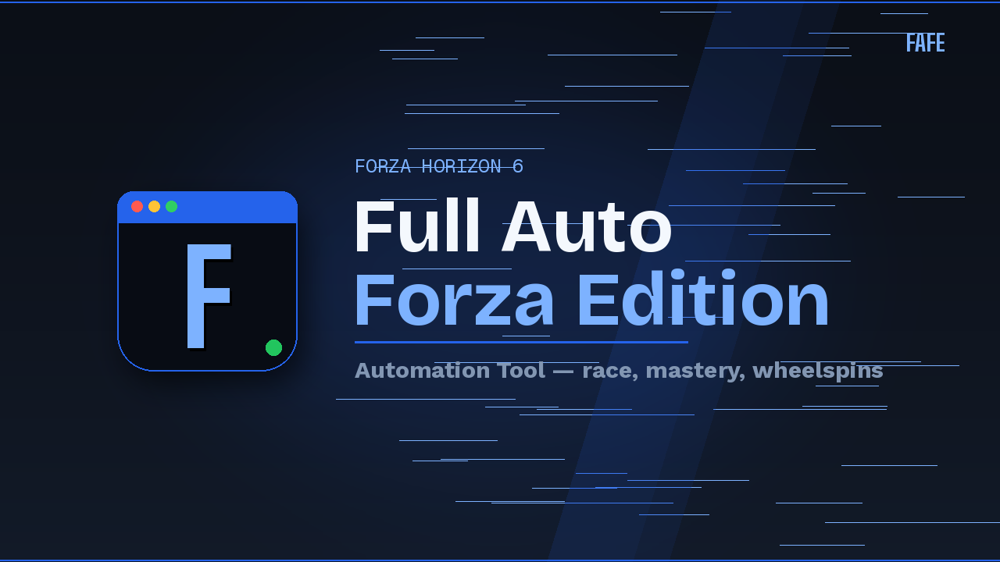

# Full Auto Forza Edition (FAFE)

FAFE is a Windows automation tool for Forza Horizon 6. It is built for the parts of the game that become repetitive after the first few hundred times: AFK race farming, buying cars in batches, unlocking mastery-tree rewards, spinning Wheelspins, and deleting used cars.

The app does not modify game files, inject code, or talk to the game process directly. It watches the screen, matches known UI elements, and sends normal keyboard or mouse input.

[Website and guides](https://leoncrispybacon.github.io/Full-Auto-Forza-Edition/) / [Latest release](https://github.com/Leoncrispybacon/Full-Auto-Forza-Edition/releases/latest) / [Discord](https://discord.gg/yfn8Vw8Ypf)

## What FAFE can do

### AFK Races

Detects the race start, finish, and restart screens, then keeps the race loop moving automatically. FAFE holds the driving input during the race, restarts when the game reaches the restart menu, and repeats until you stop it.

### Unlock Spin Wheel from mastery trees

Walks through a selected block of cars in your garage, opens each car's mastery tree, and unlocks the nodes you configured in the grid. This is keyboard-driven, so you do not need to click every node for every car.

### Auto Buy cars in batch

Repeats the purchase flow for the currently selected car. It can start from the main menu for the built-in 22B-STI route, or you can manually open any car in Car Collection first and let FAFE repeat the same purchase sequence.

### Auto Wheelspin

Runs normal Wheelspins or Super Wheelspins, collects rewards, and handles duplicate-car prompts. Duplicate handling can be set to keep cars or sell duplicate cars, depending on how you want to manage the rewards.

### Delete Used Cars

Deletes cars one by one across a selected garage range. This is intentionally separated from buying and Wheelspins because deleting cars is destructive and should be started only when you are sure the selected range is correct.

## Why it works on different setups

- Background mode captures and controls the game through the game window, so FAFE can keep working while the game is unfocused or covered by another window.
- Built-in templates are authored once and scaled to the current resolution.
- Per-template thresholds and custom capture are available when a UI element looks different on your setup.
- Optional OCR confirmation can be enabled for difficult text detection, but normal pixel matching is the default because it is lighter on the CPU.
- Traditional Chinese and English UI are included.
- Hotkeys, UI scale, monitor selection, timing values, theme, and overlay behavior can be adjusted from Settings.

The game must not be minimized. A covered or unfocused window is fine; a minimized game usually stops rendering usable frames.

## Requirements

- Windows 10 or Windows 11
- Forza Horizon 6
- A windowed or borderless game window
- Administrator mode only if the game itself is running as administrator

If the game is elevated and FAFE is not, Windows can silently block the injected input. In that case, run FAFE as administrator too.

## Download and run

1. Download the latest `FAFE.zip` from the [Releases page](https://github.com/Leoncrispybacon/Full-Auto-Forza-Edition/releases/latest).
2. Extract the zip somewhere writable, such as your Desktop or Downloads folder.
3. Run `FAFE.exe`.
4. Pick a function from the sidebar.
5. Follow the guide for that function, then start it from the app or press `F9`.

No installer is required.

## First-time setup

Start with the website guides if you are new:

- [English guides](https://leoncrispybacon.github.io/Full-Auto-Forza-Edition/en/guides/)
- [Traditional Chinese guides](https://leoncrispybacon.github.io/Full-Auto-Forza-Edition/zh-tw/guides/)

In most cases, the built-in templates are enough. If detection misses a button or reads the wrong screen, open the function's Setup & Templates panel and recapture the specific template from your own game.

Recommended habits:

- Keep the game in borderless or windowed mode.
- Do not minimize the game while FAFE is running.
- Use the same game-menu language as the template set you selected.
- Press `F9` to stop if the automation is not doing what you expected.
- Use `F12` to create a bug report bundle when asking for help.

## Hotkeys

Default hotkeys:

| Action | Key |
| --- | --- |
| Start / stop automation | `F9` |
| Capture template / region | `Caps Lock` |
| Create bug report | `F12` |
| Toggle overlay | `F10` |

All of these can be changed in Settings.

## Troubleshooting

### FAFE detects nothing

Check that the correct monitor is selected, the game is not minimized, and the correct template language is selected. If one specific screen is failing, recapture that template from the Setup & Templates panel.

### The app detects the screen but the game does not respond

If Forza is running as administrator, run FAFE as administrator too. Windows blocks lower-privilege apps from sending input to elevated windows.

### The automation starts from the wrong place

Each function expects a specific starting screen. Use the guide for that function and get the game to the shown screen before pressing Start.

### Performance feels worse while running

Keep OCR disabled unless you need it. Pixel matching is the intended default path and is much lighter than OCR.

## Reporting bugs

Press `F12` while the game is open to create a report zip. It includes an annotated screenshot, recent logs, app settings, and basic system information. Send that zip in Discord with a short description of what you expected FAFE to do and what happened instead.

Please do not send only "it doesn't work" if you can avoid it. A screenshot or F12 report usually saves a lot of guessing.

## Project notes

FAFE is a personal tool that grew into a public release. The goal is not to be clever for its own sake; the goal is to make the boring parts reliable enough that you can stop babysitting menus.

The packaged release is the recommended way to use it. The source is here for transparency, issue investigation, and community fixes.

## Support

Questions, bug reports, and update notes are handled on [Discord](https://discord.gg/yfn8Vw8Ypf).

If FAFE saves you time and you want to support development, you can buy me a coffee here: [paypal.me/Leonbacon](https://paypal.me/Leonbacon).

## Disclaimer

FAFE is unofficial and is not affiliated with Microsoft, Xbox Game Studios, Playground Games, Turn 10 Studios, or the Forza Horizon team.

Automation tools can carry account or gameplay risk. Use FAFE at your own discretion.
